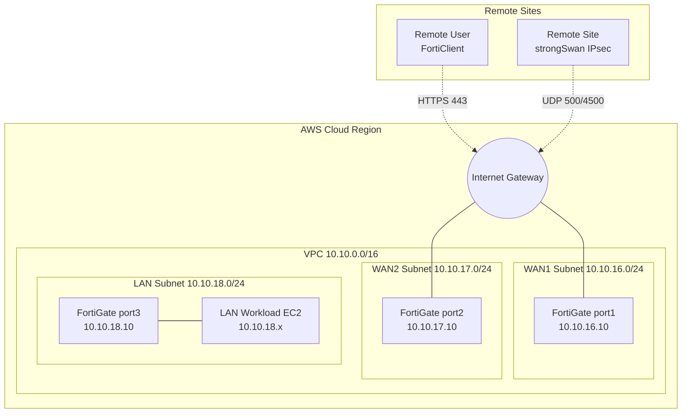

# Enterprise SD-WAN and Secure Remote Access using FortiGate on AWS

[](https://opensource.org/licenses/MIT)

## Project Overview
This project demonstrates a production-grade deployment of a **FortiGate Next-Generation Firewall (NGFW)** on AWS. The lab environment focuses heavily on core Cloud Network Security capabilities including **Dual-WAN SD-WAN**, **SSL-VPN**, **Site-to-Site IPsec VPN**, **NAT**, and **Unified Threat Management (UTM)**. 

> **Note:** This project focuses strictly on **Network Security and Routing Engineering**. Infrastructure-as-Code (Terraform) and full-stack application deployments are demonstrated in my separate **Hospital Booking** project.

## CV Summary
### English
**FortiGate SD-WAN & Secure Remote Access on AWS**
Designed and validated a cloud network security lab using FortiGate VM on AWS, implementing dual-WAN SD-WAN failover, SSL-VPN remote access, site-to-site IPsec VPN to strongSwan, protected LAN routing, firewall policies, NAT, ZeroSSL certificate integration, and UTM/Web Filter validation.

### Vietnamese
**Triển khai mô hình Cloud Network Security với FortiGate trên AWS**
Bao gồm SD-WAN dual-WAN failover, SSL-VPN remote access, IPsec site-to-site với strongSwan, protected LAN routing, firewall policy, NAT, ZeroSSL certificate và kiểm thử UTM/Web Filter log.

---

## Project Scope
### In Scope
- AWS VPC network segmentation and routing
- FortiGate VM interface mapping (WAN1, WAN2, LAN)
- Dual-WAN SD-WAN with SLA health checks
- SSL-VPN remote access (Portal & Tunnel mode)
- Site-to-site IPsec VPN (FortiGate to strongSwan)
- Firewall policy and NAT engineering
- UTM/Web Filter validation
- Routing and failover troubleshooting

### Out of Scope
- Full-stack application deployment
- Infrastructure-as-Code automation (Terraform/CloudFormation)
- CI/CD pipeline integration

---

## Architecture Overview



---

## Current IP Addressing Plan
This project utilizes the following IP address schema to align with the active lab validations:

| Component | Network / IP Address | Description |
|-----------|-----------------------|-------------|
| **AWS VPC** | `10.10.0.0/16` | Main AWS Virtual Private Cloud |
| **WAN1 Subnet** | `10.10.16.0/24` | AWS Public Subnet 1 |
| **WAN2 Subnet** | `10.10.17.0/24` | AWS Public Subnet 2 |
| **LAN Subnet** | `10.10.18.0/24` | AWS Private Subnet |
| **FGT port1** | `10.10.16.10` | FortiGate WAN1 Interface |
| **FGT port2** | `10.10.17.10` | FortiGate WAN2 Interface |
| **FGT port3** | `10.10.18.10` | FortiGate LAN Gateway |
| **VPN Pool** | `10.212.134.0/24` | SSL-VPN Client IP Pool |

---

## Test Results

The architecture has been rigorously tested. Below is a summary of the validation:

| Test Case | Expected Result | Actual Result | Status |
|-----------|-----------------|---------------|--------|
| **LAN to Internet** | EC2 instance in LAN can ping 8.8.8.8 via FGT port3 | Success | ✅ PASS |
| **SD-WAN WAN1 healthy** | SLA Health Check to 8.8.8.8 shows UP | Success | ✅ PASS |
| **SD-WAN Failover** | Taking WAN1 offline routes traffic to WAN2 seamlessly | Success | ✅ PASS |
| **SSL-VPN login** | User can access web portal via valid ZeroSSL cert | Success | ✅ PASS |
| **SSL-VPN to LAN** | FortiClient user can ping/SSH to 10.10.18.x | Success | ✅ PASS |
| **IPsec Tunnel Up** | IKE/CHILD SA establish with strongSwan peer | Success | ✅ PASS |
| **IPsec Reachability** | Ping succeeds between 10.10.18.x and 192.168.100.x | Success | ✅ PASS |
| **UTM Web Filter** | Traffic to restricted categories is blocked; logs generated | Success | ✅ PASS |

---

## Security Hardening Summary
- **Administrative Port Rebinding**: Moved Admin GUI to port `8443` to prevent conflicts and obscure access.
- **Dedicated SSL-VPN Port**: SSL-VPN secured on standard port `443` with a valid ZeroSSL certificate.
- **Private Subnet Architecture**: The LAN subnet (`10.10.18.0/24`) has no direct Internet route; all egress is routed strictly through the FortiGate inspection engine.
- **Least Privilege Access**: AWS Security Groups locked down to essential ports (UDP 500/4500, TCP 443, ICMP).
- **Default Deny Strategy**: Strict implicit deny rule applied to the bottom of the FortiGate firewall policy list.

---

## Repository Structure
```text
FortiGate-SDWAN-SecureRemoteAccess-AWS/
├── README.md                           # Project overview and details
├── LICENSE                             # MIT License
├── .gitignore                          # Git ignore file
├── images/                             # Lab screenshots and evidence
├── diagrams/                           # Network architecture diagrams
│   ├── topology.md
│   └── packet-flow.md
├── configs/                            # Sanitized configurations
│   ├── fortigate-interface-sanitized.txt
│   ├── fortigate-sdwan-sanitized.txt
│   ├── fortigate-firewall-policy-sanitized.txt
│   ├── fortigate-sslvpn-sanitized.txt
│   ├── fortigate-ipsec-sanitized.txt
│   └── strongswan-ipsec-sanitized.conf
└── docs/                               # Detailed project documentation
    ├── validation-checklist.md
    ├── troubleshooting-runbook.md
    ├── packet-flow.md
    ├── security-hardening.md
    └── lessons-learned.md
```

---

## Skills Demonstrated
- **AWS VPC Networking**: Subnetting, Route Table manipulation, Security Groups, ENI management.
- **Firewall Engineering**: Interface mapping, Firewall Policies, NAT configuration, Default Gateway routing.
- **SD-WAN**: Dual-WAN deployment, Virtual-WAN-Link, Performance SLAs, Failover rules.
- **Secure Remote Access (SSL-VPN)**: Portal/Tunnel mode setup, Split-tunneling, User group mapping, ZeroSSL integration.
- **Site-to-Site VPN (IPsec)**: IKEv2 Phase 1 / Phase 2 configuration, Traffic Selectors, strongSwan integration.
- **Threat Mitigation**: Web Filtering, UTM profile application, Log analysis.
- **Troubleshooting**: Packet flow tracking, asymmetric routing resolution, certificate validation.
- **Technical Documentation**: High-quality architecture diagrams and runbooks.

---

## Future Improvements
- Integrate Active Directory (LDAP/RADIUS) for SSL-VPN central authentication.
- Implement FortiAnalyzer for centralized log retention and advanced reporting.
- Implement Intrusion Prevention System (IPS) profiles for deep packet inspection on inbound VPN traffic.
