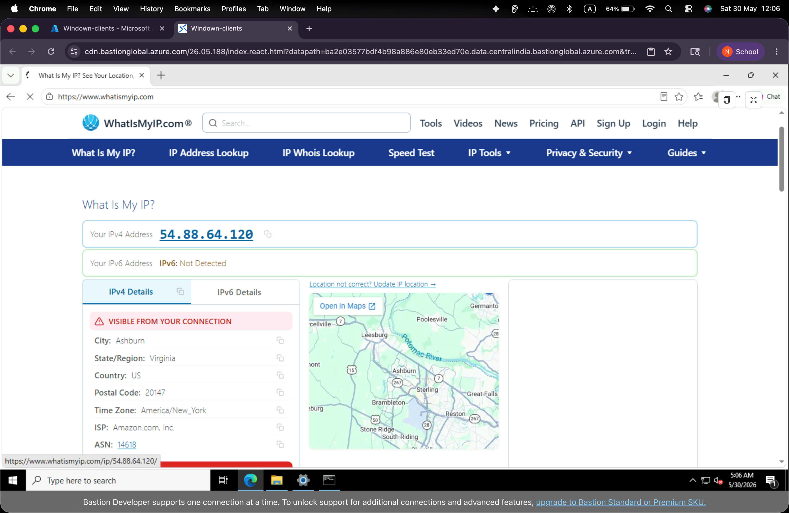

# Enterprise SD-WAN and Secure Remote Access using FortiGate on AWS

## 1. Executive Summary
This technical report documents the design, implementation, and verification of an Enterprise SD-WAN and Secure Remote Access solution deployed using Fortinet FortiGate on Amazon Web Services (AWS). The project integrates AWS cloud infrastructure with FortiGate's advanced routing and security capabilities to provide resilient Internet connectivity, secure SSL-VPN remote access, and site-to-site IPsec VPN integration.

## 2. Architecture & Topology
### 2.1 AWS Infrastructure
The AWS environment consists of a custom VPC, route tables, and security groups supporting the FortiGate virtual appliance and internal EC2 instances.

We have configured specific Route Tables in AWS to support the SD-WAN and internal LAN subnets.

The internal EC2 instance (lan-client) is protected by a dedicated Security Group allowing inbound ICMP and SSH.

### 2.2 FortiGate Configuration & Objects
The FortiGate has been configured with relevant Addresses and Subnets such as the LAN subnet and SSL-VPN tunnel address pool.

## 3. Implementation Details

### 3.1 Firewall Policies & Security Profiles
Granular firewall policies were established to control traffic flow from LAN to Internet, SSLVPN to LAN, and SSLVPN to Internet.

A Web Filter profile was applied to actively restrict unauthorized or non-business-related domains.

The ZeroSSL Certificate ensures the SSL-VPN portal operates without trust warnings for users.

### 3.2 Site-to-Site IPsec VPN
An IPsec tunnel named `Oracle_IPsec` was established linking the FortiGate to a remote strongSwan VPS endpoint.

The Phase 1 and Phase 2 configurations enforce strong encryption (AES256-SHA256).

The IPsec widget confirms the active status and data transferred across the tunnel.

## 4. Verification & Testing Outcomes

### 4.1 Internal Connectivity & Routing
The internal `lan-client` successfully connected via EC2 Instance Connect and acquired its internal IP `10.10.18.44`.

We successfully verified outbound internet access from the `lan-client` via ICMP ping and `curl ifconfig.me`.

### 4.2 SSL-VPN Client Validation
Clients successfully obtained a public IP matching the FortiGate AWS IP when running a full tunnel VPN, confirmed here on a mobile client.

Similarly, Windows SSL-VPN clients effectively tunneled their internet traffic out the AWS node.

The Windows SSL-VPN client also successfully pinged the internal LAN gateway.

### 4.3 Site-to-Site VPN Verification
Successful ICMP ping tests were executed from the FortiGate CLI targeting the remote IPsec endpoint.

### 4.4 Security Policy Enforcement
Traffic logs demonstrated active routing and allowed connections for SSL-VPN users to external destinations.

Security events highlighted active enforcement, showing `Video/Audio` traffic blocks.

## 5. Conclusion
The deployment successfully integrates AWS infrastructure with FortiGate’s SD-WAN and VPN capabilities. It provides a robust edge architecture, enforces a secure zero-trust boundary for remote workers, and ensures reliable site-to-site connectivity.
