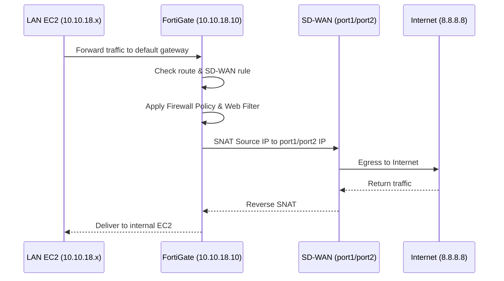
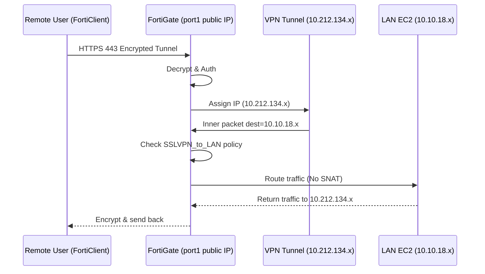

# Packet Flow Diagrams

## 1. LAN to Internet (Outbound)

```mermaid
sequenceDiagram
    participant LAN as LAN EC2 (10.10.18.x)
    participant FGT as FortiGate (10.10.18.10)
    participant WAN as SD-WAN (port1/port2)
    participant INET as Internet (8.8.8.8)

    LAN->>FGT: Forward traffic to default gateway
    FGT->>FGT: Check route & SD-WAN rule
    FGT->>FGT: Apply Firewall Policy & Web Filter
    FGT->>WAN: SNAT Source IP to port1/port2 IP
    WAN->>INET: Egress to Internet
    INET-->>WAN: Return traffic
    WAN-->>FGT: Reverse SNAT
    FGT-->>LAN: Deliver to internal EC2
```

## 2. SSL-VPN to LAN (Inbound)

```mermaid
sequenceDiagram
    participant User as Remote User (FortiClient)
    participant FGT as FortiGate (port1 public IP)
    participant VPN as VPN Tunnel (10.212.134.x)
    participant LAN as LAN EC2 (10.10.18.x)

    User->>FGT: HTTPS 443 Encrypted Tunnel
    FGT->>FGT: Decrypt & Auth
    FGT->>VPN: Assign IP (10.212.134.x)
    VPN->>FGT: Inner packet dest=10.10.18.x
    FGT->>FGT: Check SSLVPN_to_LAN policy
    FGT->>LAN: Route traffic (No SNAT)
    LAN-->>FGT: Return traffic to 10.212.134.x
    FGT-->>User: Encrypt & send back
```
