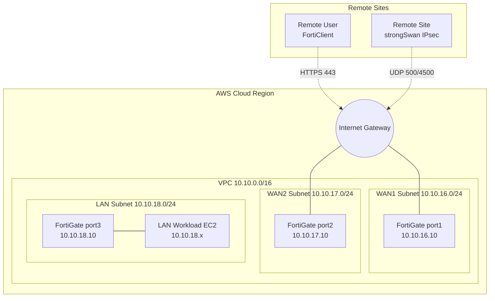

# FortiGate AWS Topology

```mermaid
graph TD
    subgraph AWS Cloud [AWS Cloud Region]
        subgraph VPC [VPC 10.10.0.0/16]
            
            subgraph WAN1_Subnet [WAN1 Subnet 10.10.16.0/24]
                FGT_P1[FortiGate port1<br>10.10.16.10]
            end
            
            subgraph WAN2_Subnet [WAN2 Subnet 10.10.17.0/24]
                FGT_P2[FortiGate port2<br>10.10.17.10]
            end
            
            subgraph LAN_Subnet [LAN Subnet 10.10.18.0/24]
                FGT_P3[FortiGate port3<br>10.10.18.10]
                EC2_App[LAN Workload EC2<br>10.10.18.x]
            end
            
        end
        IGW((Internet Gateway))
    end
    
    subgraph Remote Sites
        SSLVPN_User[Remote User<br>FortiClient]
        StrongSwan[Remote Site<br>strongSwan IPsec]
    end
    
    IGW --- FGT_P1
    IGW --- FGT_P2
    FGT_P3 --- EC2_App
    
    SSLVPN_User -.->|HTTPS 443| IGW
    StrongSwan -.->|UDP 500/4500| IGW
```
