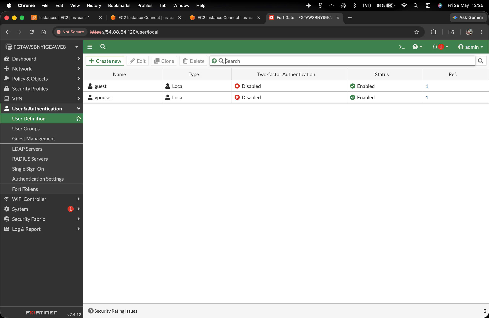
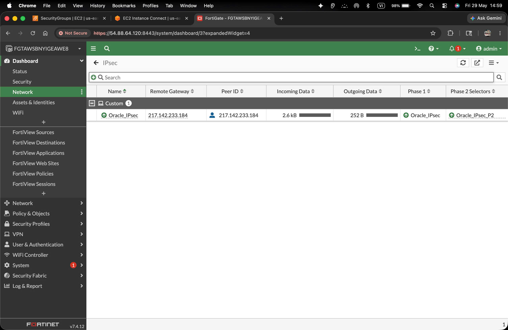

# 1. Cover Page

**Enterprise SD-WAN and Secure Remote Access using FortiGate on AWS**
*A Comprehensive Technical Deployment Report*

**Repository Name:** FortiGate-SDWAN-SecureRemoteAccess-AWS
**Target Environment:** Amazon Web Services (AWS)
**Core Technologies:** Fortinet FortiGate, AWS VPC, EC2, SD-WAN, SSL-VPN, IPsec

---

# 2. Executive Summary

This report provides a detailed technical overview of an enterprise-grade secure network architecture deployed within Amazon Web Services (AWS) using a Fortinet FortiGate virtual appliance. The primary objective of the deployment was to establish a resilient, highly available dual-WAN SD-WAN architecture with secure remote access for employees and site-to-site IPsec VPN connectivity. By integrating FortiGate's advanced threat protection, SSL-VPN capabilities, and SD-WAN intelligence with AWS infrastructure, the architecture delivers a zero-trust network boundary capable of supporting a modern, distributed workforce.

# 3. Project Background

As remote work and distributed architectures become standard, relying solely on cloud-native security groups and standard internet gateways lacks the granular inspection and dynamic routing required by enterprise compliance standards. This project addresses the need for a unified threat management system in the cloud that can seamlessly handle automated WAN failover, enforce application-level web filtering, and securely tunnel remote employees into internal cloud resources using verified certificates.

# 4. Objectives

- **Resilient Connectivity:** Implement Dual-WAN SD-WAN with SLA-driven automated failover to ensure high availability for inbound and outbound traffic.
- **Secure Remote Access:** Deploy SSL-VPN with custom domain resolution (`vpn.nguyenchithanhit.id.vn`) and a trusted ZeroSSL certificate to prevent browser warnings.
- **Site-to-Site Integration:** Establish a robust IPsec VPN tunnel to a remote strongSwan VPS for extending the corporate network footprint.
- **Granular Security:** Enforce firewall policies, web filtering, and NAT, restricting lateral movement and explicitly controlling outbound access from internal subnets.

# 5. Solution Overview

The solution bridges AWS infrastructure components (VPCs, Route Tables, Security Groups) with FortiOS security features. The FortiGate VM is deployed with three network interfaces (WAN1, WAN2, and LAN). It uses the SD-WAN logical interface (`virtual-wan-link`) for intelligent traffic steering. Remote workers authenticate via FortiClient (Windows/iOS) using SSL-VPN on port 443, isolated from the management GUI on port 8443. An IPsec tunnel connects the FortiGate to external infrastructure, creating a secure overlay network.

# 6. Network Topology and Architecture

The architecture relies on an AWS VPC (10.10.0.0/16) segmented into three subnets: WAN1 (10.10.16.0/24), WAN2 (10.10.17.0/24), and LAN (10.10.18.0/24). The FortiGate VM acts as the default gateway for the LAN subnet (10.10.18.10). 

*Figure 6.1: The internal EC2 instance (lan-client) deployed within the protected 10.10.18.0/24 subnet, completely dependent on the FortiGate for ingress/egress.*

# 7. AWS Infrastructure Design

The underlying AWS routing was designed to force all internet-bound traffic from the private LAN subnet directly through the FortiGate VM's internal Elastic Network Interface (ENI). 

*Figure 7.1: AWS Route Table configuration showing the default route (0.0.0.0/0) directed to the FortiGate ENI (eni-0b7...).*

Additionally, Security Groups were tailored to restrict access based on the principle of least privilege. The FortiGate public interfaces accept required VPN ports, while internal instances strictly limit access.

*Figure 7.2: Security Group assigned to the internal LAN client, explicitly allowing inbound ICMP and SSH (Port 22) exclusively from the VPN and LAN IP space.*

# 8. FortiGate Deployment

The FortiGate virtual appliance was deployed via the AWS Marketplace and initialized with administrative access on a non-standard port (8443) to avoid conflicts with the SSL-VPN portal (443). The device licenses and initial bootstrap configuration were validated through the EC2 serial console. 

# 9. Interface and Address Configuration

To maintain organized firewall policies, explicit Address Objects and IP Pools were created corresponding to the AWS subnets and VPN clients. 

*Figure 9.1: Address objects including the `LAN_SUBNET` and the `SSLVPN_TUNNEL_ADDR1` IP range used for assigning virtual IPs to remote workers.*

# 10. Firewall Policy and NAT Design

A strict security posture was adopted, rejecting all traffic by default and creating explicit allow rules for required data flows. The `virtual-wan-link` SD-WAN interface is used as the outbound destination to abstract the physical WAN1/WAN2 failover from the firewall policy layer.

*Figure 10.1: Granular firewall policies outlining `LAN_to_Internet`, `SSLVPN_to_LAN`, and `SSLVPN_to_Internet` (split-tunneling capability).*

# 11. SD-WAN Configuration

The SD-WAN configuration abstracts the dual AWS Elastic IPs assigned to port1 and port2. Both interfaces are added as SD-WAN members. The SD-WAN rules are designed to balance traffic and utilize both links. By referencing the `virtual-wan-link` in the firewall policy, the FortiGate seamlessly redirects user traffic through the surviving link without requiring policy updates during a failure event.

# 12. SLA Health Check and WAN Failover

To guarantee automatic WAN failover, SLA Health Checks (Performance SLAs) were established. The FortiGate continuously probes reliable external targets (e.g., public DNS servers) via ICMP/HTTP across both WAN1 and WAN2. If packet loss or latency exceeds defined thresholds on the primary link, the SLA logic automatically withdraws the compromised route, instantly forcing all subsequent sessions out of the secondary WAN interface. This ensures uninterrupted connectivity for internal servers and outbound VPN traffic.

# 13. Public Domain and ZeroSSL Certificate Deployment

To provide a professional and secure SSL-VPN login experience without browser warnings, a custom domain (`vpn.nguyenchithanhit.id.vn`) was registered and bound to the FortiGate's primary Elastic IP. 

*Figure 13.1: Command-line DNS verification (`dig` and `nslookup`) confirming successful resolution of the domain to the AWS public IP.*

A valid SSL certificate was generated via ZeroSSL, imported into the FortiGate, and applied to the SSL-VPN settings.

*Figure 13.2: Certificate details indicating successful issuance and validation by the ZeroSSL Certificate Authority.*

# 14. SSL-VPN Configuration

The SSL-VPN tunnel was configured on TCP Port 443 (requiring the GUI to be moved to 8443). The tunnel assigns IPs from the `10.212.134.200-210` pool. Authentication is governed by local user groups.

*Figure 14.1: FortiGate User Groups showing the `SSLVPN_USERS` firewall group.*

*Figure 14.2: CLI output detailing the SSL-VPN source interface mapping, port assignment, and server certificate application.*

*Figure 14.3: Overview of the SSL VPN settings including cipher restrictions, default portals, and authentication rules.*

# 15. SSL-VPN Remote Workforce Connectivity

Remote employees utilize the FortiClient application on Windows and iOS devices to establish a full-tunnel or split-tunnel connection back to the AWS VPC.

*Figure 15.1: FortiClient on an iPhone successfully authenticated, securing the virtual IP `10.212.134.200`.*

When connected via full-tunnel, internet traffic exits via the FortiGate's AWS IP, masking the employee's actual location.

*Figure 15.2: Mobile device showing its public IP matching the AWS FortiGate node during an active VPN session.*

*Figure 15.3: Windows client similarly tunneling all traffic, verifying the NAT functionality over the VPN.*

# 16. IPsec Site-to-Site VPN

To integrate with a remote strongSwan VPS, a Site-to-Site IPsec VPN was provisioned using strong cryptographic standards (AES256-SHA256). 

*Figure 16.1: Overview of the configured `Oracle_IPsec` tunnel in the FortiGate GUI.*

*Figure 16.2: Phase 1 and Phase 2 proposals ensuring maximum security without compromising performance.*

*Figure 16.3: Dashboard IPsec widget showing the tunnel up and passing data.*

*Figure 16.4: Granular view of IPsec Phase 2 selectors and Rx/Tx bytes.*

# 17. Routing, Session and NAT Validation

To prove that the FortiGate is successfully routing and NATing traffic for internal AWS resources, we verified connectivity from the internal `lan-client`.

*Figure 17.1: EC2 Instance Connect session showing the lan-client interface (`10.10.18.44`).*

*Figure 17.2: The LAN client successfully pings `8.8.8.8` and uses `curl ifconfig.me` to confirm it is NATed behind the FortiGate's Elastic IP.*

Furthermore, we proved bidirectional reachability by having a remote Windows SSL-VPN client ping the internal LAN gateway.

*Figure 17.3: The SSL-VPN client (`10.212.134.200`) successfully pinging the FortiGate LAN interface (`10.10.18.10`).*

# 18. Security Policy Enforcement

The FortiGate acts as a Next-Generation Firewall (NGFW). Web Filtering was applied to outbound internet access to prevent users from visiting malicious or non-compliant domains.

*Figure 18.1: Web Filter profile configuration detailing category-based blocking (e.g., Potentially Liable, Security Risk).*

When traffic traverses the FortiGate, it is logged and analyzed. The Forward Traffic logs show the allowed NAT translations.

*Figure 18.2: Traffic logs confirming SSL-VPN users accessing external resources via SNAT.*

Security Events capture active blocks. 

*Figure 18.3: UTM logs showing an active block on `Video/Audio` traffic, proving the Web Filter is functioning correctly.*

# 19. Testing and Verification Results

To verify the IPsec tunnel's integrity, ICMP echo requests were sourced directly from the FortiGate CLI, specifically bound to the internal interface to test the Phase 2 selectors.

*Figure 19.1: Successful ping responses from the remote `10.10.20.1` subnet across the `Oracle_IPsec` tunnel.*

# 20. Troubleshooting and Challenges

During the initial deployment, accessing the SSL-VPN portal triggered an SSL certificate error `ERR_CERT_AUTHORITY_INVALID` in the Edge browser. 

*Figure 20.1: The initial untrusted certificate warning prior to deploying the ZeroSSL certificate.*

**Resolution:** This occurred because FortiGate defaults to a self-signed `Fortinet_Factory` certificate. The issue was resolved by generating a trusted ZeroSSL certificate, importing the certificate and its CA bundle into FortiGate, and modifying the VPN SSL settings to use the new certificate. 

Additionally, we faced a port conflict when both the Admin GUI and the SSL-VPN portal were assigned to Port 443. We resolved this by migrating the Admin GUI to Port 8443, ensuring SSL-VPN clients could seamlessly connect on the standard HTTPS port without interference.

# 21. Security Considerations

- **Management Isolation:** Administrative GUI access is restricted to the internal LAN interface. External administration is disabled on WAN interfaces to reduce the attack surface.
- **Strict Cryptography:** IPsec tunnels employ AES-256 and SHA-256 exclusively. Weak ciphers like DES and MD5 are disabled.
- **Zero Trust:** SSL-VPN users are placed in a dedicated zone and must pass explicit firewall policies to reach internal resources. 

# 22. Future Enterprise Extension

To scale this deployment for a larger enterprise environment, several extensions are planned:
- **AD / LDAP Authentication:** Integrating the FortiGate with an Active Directory (AD) Domain Controller to allow users to authenticate using their corporate credentials.
- **AD Group Mapping:** Utilizing FSSO (Fortinet Single Sign-On) to map AD security groups to FortiGate user groups, applying different firewall policies based on department (e.g., HR vs. Engineering).
- **Split Tunnel by Group:** Configuring advanced split tunneling so that only specific groups (like IT Admins) have full-tunnel access, while standard users only tunnel corporate subnet traffic, saving AWS egress bandwidth.
- **Azure-Forti Integration:** Establishing an IPsec tunnel between this AWS FortiGate and an Azure vWAN to facilitate multi-cloud LDAP reachability and cross-cloud disaster recovery.

# 23. Conclusion

The FortiGate deployment on AWS successfully delivered a highly available SD-WAN architecture with secure, encrypted remote access. By abstracting the physical AWS ENIs behind SD-WAN virtual links and strictly controlling traffic through Next-Generation Firewall policies, the network provides a resilient and impenetrable perimeter for cloud-hosted assets.

# 24. Appendix

- **FortiOS Version:** 7.4.x
- **Instance Type:** c5.large (Compute Optimized)
- **AWS Region:** us-east-1
- **Domain Registrar:** nguyenchithanhit.id.vn
- **Certificate Authority:** ZeroSSL

*End of Report*
